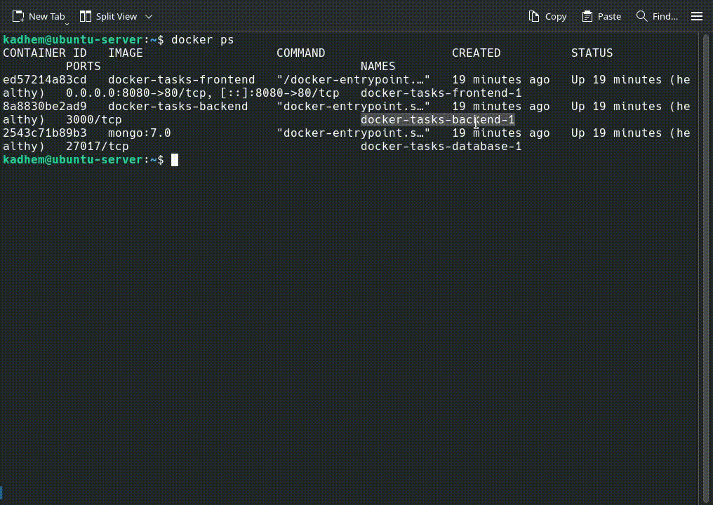
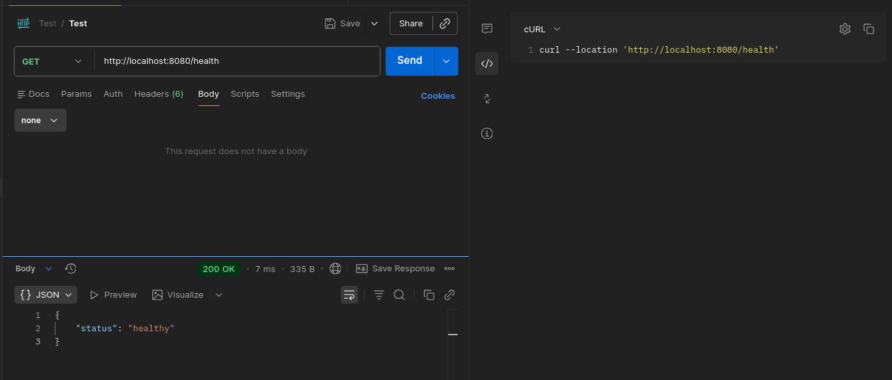
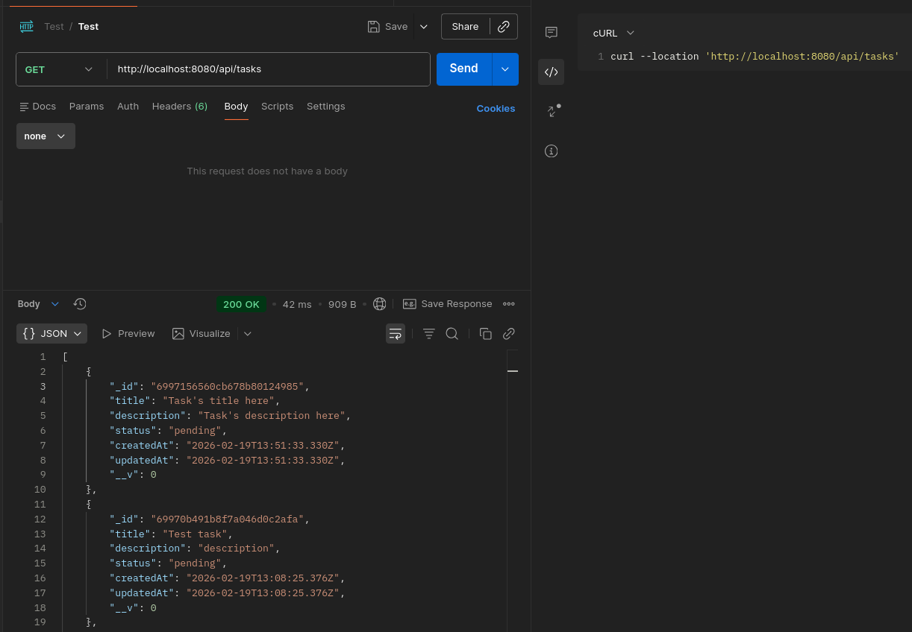
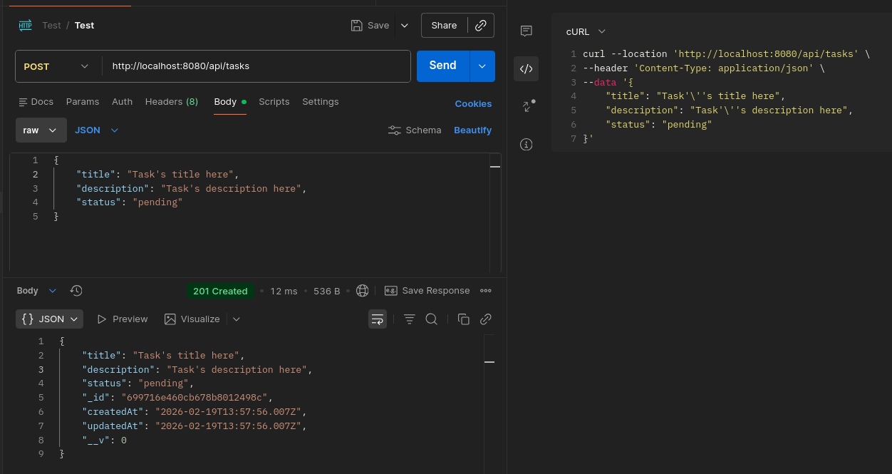
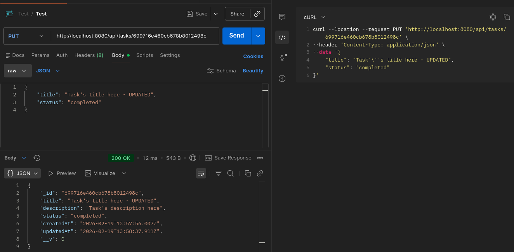
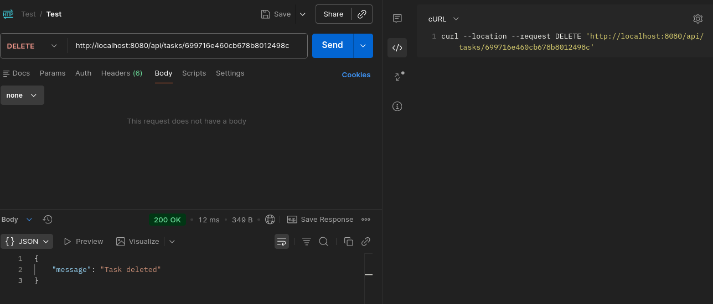
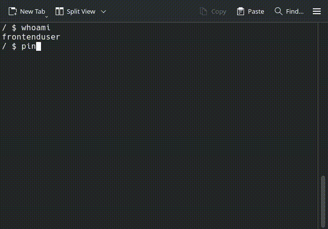

## Résumé du projet

Ce dépôt contient une application web trois-tiers (frontend, backend, base de données) packagée avec **Docker Compose**. L’objectif du laboratoire est d’implémenter la stack, d’appliquer des bonnes pratiques DevOps (multi-stage builds, healthchecks, limites de ressources, réseaux isolés, volumes persistants) et de documenter les **Tests de Validation** demandés dans le sujet.

### Stack utilisée (mentionnée une seule fois)

* Frontend : React (build Vite).
* Backend : Express (Node.js).
* Base de données : MongoDB.
* Serveur statique / reverse proxy : Nginx.
* Gestion des conteneurs : Docker/Docker Compose.

---

## Structure du dépôt

```
.
├─ react-tasks-frontend/      # React (Vite)
│  ├─ nginx.conf              # Ficher d'configuration serveur web static Nginx
├─ express-tasks-backend/     # Express Backend Server
│  ├─ Dockerfile
│  ├─ init/                   # scripts d'initialisation DB (init-db.sh)
├─ docker-compose.yml
├─ .env                       
├─ .dockerignore
└─ screenshots/               # captures
```

---

## Pré-requis

* Docker & Docker Compose installés et opérationnels sur la machine (voir commandes utiles plus bas).
* Le fichier `.env` à la racine contenant au minimum :

```
DB_ROOT_USER=...
DB_ROOT_PASSWORD=...
DB_NAME=...
DB_APP_USER=...
DB_APP_PASSWORD=...
PORT=3000
VITE_API_URL=/api
```

Ne commitez jamais vos mots de passe.

---

## Déploiement Kubernetes (K3s)

Les manifests Kubernetes sont disponibles dans `k3s/` et couvrent :
* Namespace dédié `tasks-app`
* Deployments (frontend, backend, database), Services (ClusterIP + NodePort), ConfigMaps, Secrets
* PVC + StorageClass, probes (readiness/liveness), resources, stratégie de déploiement
* Ingress (optionnel) et HPA (bonus)

Avant d’appliquer :
* Remplacer les images `tasks-frontend:v1.0.0` et `tasks-backend:v1.0.0` par vos images publiées ou chargées dans le cluster.
* Mettre à jour le Secret `db-secrets` avec vos valeurs réelles.
* Adapter l’hôte de l’Ingress (`tasks.local`) si nécessaire.

Exemple d’application des manifests :
```bash
kubectl apply -f k3s/namespace.yaml
kubectl apply -f k3s/storageclass.yaml
kubectl apply -f k3s/
```

Accès frontend (NodePort) : `http://<node-ip>:30080`.

---

## Démonstration complète d'application + Preuve de persistance

👉 [Voir la vidéo de démonstration](https://drive.google.com/file/d/1lD0LGpLway7i1ajiTylwehRuIllMRwrJ/view?usp=sharing)

---

# Tests et Validation

## Test 1 : Connectivité Base de Données (backend → database)

**Objectif :** Vérifier que le backend peut se connecter à MongoDB.



---

## Test 2 : API Backend

**Objectif :** Tester l’endpoint `/health` et les endpoints CRUD.

**GET - /health**


**GET - /api/tasks**


**POST - /api/tasks**


**PUT - /api/tasks/:id**


**DELETE - /api/tasks/:id**


---

## Test 3 : Frontend

**Objectif :** Vérifier l’interface utilisateur et les opérations CRUD dans le navigateur.

**Captures à fournir :**

👉 [Voir la vidéo de démonstration](https://drive.google.com/file/d/1lD0LGpLway7i1ajiTylwehRuIllMRwrJ/view?usp=sharing)

---

## Test 4 : Isolation Réseau (frontend ≠> database interdit)

**Objectif :** Prouver que le frontend ne peut pas joindre la base de données directement (principe de sécurité du sujet).

**Preuve / capture à fournir :**


---

## Test 5 : Persistance des Données

**Objectif :** Vérifier que les données persistent via volumes Docker.

**Preuve / capture :**

👉 [Voir la vidéo de démonstration](https://drive.google.com/file/d/1lD0LGpLway7i1ajiTylwehRuIllMRwrJ/view?usp=sharing)

---

## Test 6 : Limites de Ressources

**Objectif :** Vérifier que les limites CPU/mémoire indiquées dans `docker-compose.yml` sont appliquées.

**Preuve / capture :**


---

## Test 7 : Health Checks Docker

**Objectif :** Vérifier que tous les conteneurs atteignent l’état **healthy** et documenter le temps.

**Preuve / capture :**

👉 [Voir la vidéo de démonstration](https://drive.google.com/file/d/1lD0LGpLway7i1ajiTylwehRuIllMRwrJ/view?usp=sharing)

---

# Commandes Utiles (résumé)

```bash
# build & up
docker compose up -d --build

# voir services / health
docker compose ps
docker inspect

# logs
docker compose logs -f backend
docker compose logs -f frontend
docker compose logs -f database

# networks / volumes
docker network ls
docker volume ls

# runtime stats
docker stats

# shell in container
docker compose exec backend sh
docker compose exec frontend sh
docker compose exec database mongosh --eval 'db.runCommand({ping:1})'
```

---

# Troubleshooting courant

* **Le frontend (navigateur) ne trouve pas l’API** : vérifier `VITE_API_URL`/`API_URL` (doit être `/api` si nginx fait proxy) et `nginx.conf` proxy_pass.
* **Le backend n’arrive pas à se connecter à MongoDB** : vérifier `DB_HOST` (doit être `database`), `DB_PORT`, et que l’init script a créé l’utilisateur app. Utiliser `docker compose exec backend env | grep DB` pour vérifier.
* **Les healthchecks restent en `starting`** : inspecter `docker inspect` `.State.Health.Log` pour voir les erreurs de la commande de vérification.
* **Volumes vides après restart** : vérifier que le volume est bien monté sur le bon chemin de données du SGBD et que `docker-compose down` n’a pas été lancé avec `-v`.
* **Limites non appliquées** : `docker inspect` doit montrer `HostConfig.Memory` / `NanoCpus`; si non, vérifier la version de Docker Compose et le format du fichier (`version: "3.8"` recommandé).
